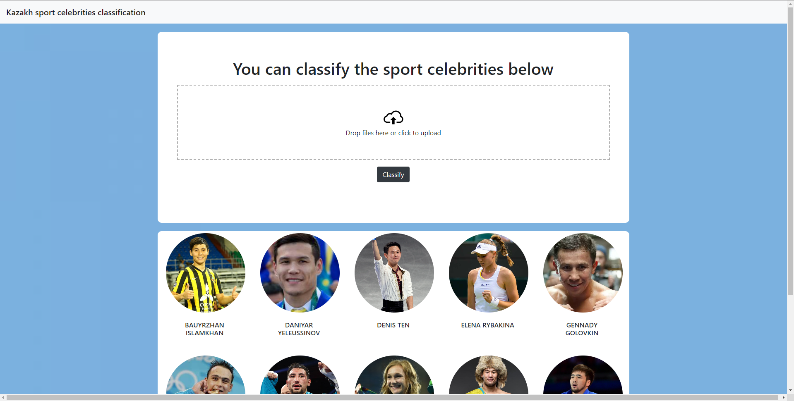
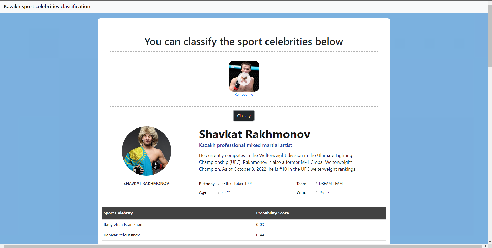

# Kazakh Sports Celebrity Image Classification

**Idea Description:**

The goal of this project is to develop a model that can classify images of Kazakh sports celebrities based on their name and sport. This model will be used to create a user-friendly interface that allows users to easily search for and identify specific sports celebrities.

________________

**Work description:**

1)	Collect images from Google using Chrome extension called “Fatcun”, this extension helps to scrap images from Google.
2)	Use OpenCV library for face and eyes detection.
3)	Data cleaning using OpenCV face detection and feature engineering using Wavelet transforms.
4)	Model building using SVM, logistic regression, random forest.
5)	Model fine tuning using GridSearchCV.
6)	Export model to a file and write Python Flask Server around it that can server HTTP requests generated by UI.
7)	Build UI using HTML, CSS,J avascript and JQuery

___________

____
**Technologies used in this project:**
+ Python
+ Numpy and OpenCV for data cleaning
+ Matplotlib & Seaborn for data visualization
+ Sklearn for model building
+ Jupyter notebook, visual studio code and pycharm as IDE
+ Python flask for http server
+ HTML/CSS/Javascript for UI

__________

**In this project I have classified 10 Kazakhstani sports celebrities:**
1) Bauyrzhan Islamkhan
2) Daniyar Yeleussinov
3) Denis Ten
4) Gennady Golovkin
5) Olga Rypakova
6) Ilya Ilyin
7) Yeldos Smetov
8) Shavkat Rakhmonov
9) Elena Rybakina
10) Janibek Alimkhanuly
    

